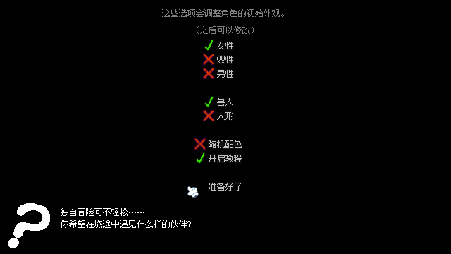

# Hole Dweller 简体中文汉化

面向 **Steam Windows r44** 的非官方简体中文补丁，使用中文像素字体，提供安装、还原、译文和构建源码。

🟢 **已提供：** 常用界面、角色对白、商店说明、教程与成就文本。  
🟡 **当前阶段：** 0.1.0 测试版，欢迎反馈译文和排版问题。

## 下载与反馈

- [下载完整汉化包](https://github.com/QianLieXian/HoleDweller-zhCN/releases)：选择 `.7z` 附件，解压后安装。
- [报告问题或建议改译](https://github.com/QianLieXian/HoleDweller-zhCN/issues)：附版本、触发步骤和完整报错。
- [项目源码](https://github.com/QianLieXian/HoleDweller-zhCN)：包含译文、安装器与构建脚本。

## 版本信息

| 项目 | 本次发布 |
| --- | --- |
| 汉化版本 | **0.1.0** |
| 适配游戏 | **Hole Dweller · Steam Windows r44** |
| 发布日期 | 2026年10月3日 |
| 译文 | 1,464条资源译文，另含中文角色显示名及界面显示转换 |
| 字体 | Fusion Pixel，12像素、等宽、简体中文变体 |
| 字体版本 | 2026.09.25 |
| 资源工具 | UndertaleModTool 0.9.2.0 |
| 安装环境 | Windows，需有 .NET Framework 4.x；一般 Windows 10/11 已具备 |
| 发布格式 | `.7z`，使用开源 7-Zip 压缩 |

**同样显示 r44 的其他发行包，也不保证兼容。** 安装器会校验原版 `data.win`，校验不符时停止安装。完整校验值见 [版本信息.json](版本信息.json)。

## 安装与还原

1. 先退出游戏。
2. 解压完整补丁包，保留目录结构。
3. 双击 **安装汉化.cmd**，选择包含 `HoleDweller.exe` 和 `data.win` 的游戏文件夹。
4. 出现安装成功提示后，从 Steam 正常启动游戏即可。

如果提示没有写入权限，右键安装脚本，选择“以管理员身份运行”。不要只复制差分文件，也不要把整个补丁目录覆盖到游戏目录。

需要恢复英文时，退出游戏，双击 **还原英文.cmd**，选择同一个目录。安装器保留的 `data.win.zhCN.original` 是原版备份，请妥善保存。Steam 验证游戏文件也可以恢复原版资源，但会覆盖汉化，需要重新安装。

安装器离线运行，自动检查安装结果，重复安装会提示已经安装。它只处理游戏资源包、随补丁提供的字体及自身备份记录；**不读取或修改存档，也不添加开机启动项。** 不同版本或其他资源模组不应直接叠加。

## 汉化内容与翻译方式

| 内容 | 状态 |
| --- | --- |
| 主菜单、设置、开场选择、常用提示 | 已翻译 |
| 角色对白、话题与技能说明 | 已完成一轮译稿 |
| 道具名称与说明、成就条件、战斗教程 | 已翻译 |
| 中文字体、按字宽换行、对白高度计算 | 已适配 |
| 角色内部名称、存档字段、模组标识 | 保留原值，显示时转换中文 |
| 标志图片、图片内文字、原版外部图片手册 | 保留原样 |
| 第三方模组新增对白 | 不在本包覆盖范围内 |
| 全流程、全部姿势及旧存档兼容性 | 尚未逐项完成实机验证 |

译文由 **GPT 结合角色语气、对白触发情境和游戏机制逐条起草、润色，并统一术语**，没有接入自动机翻服务。本版属于 AI 辅助译稿，尚未经过独立人工逐句审校，不标注为“纯人工汉化”。欢迎用具体台词、场景和截图帮助修正。

常用术语统一为：爱意、技巧、欲火、淫欲、爱心石、钻探、轮回、升华。角色中文显示名只影响显示，避免破坏原有存档和模组识别。

## 画面预览




[查看设置页](screenshots/设置.png) · [查看中文换行测试](screenshots/排版测试.png)

## 已做的检查

- 汉化资源可以构建、重新读取并启动。
- 检查了全部译文所需字形，未发现缺字。
- 实际运行检查了主菜单、设置、开场选项及中文换行；修复了新增换行函数未注册造成的对白报错。
- 差分应用后的文件与构建结果校验一致；还原后的文件与原版校验一致。
- 验证重复安装、版本不匹配拒绝，以及字体安装和还原。

目前以基础功能验证为主，不能代替完整游戏通关测试。遇到问题请附上：游戏版本、汉化版本、完整报错、触发步骤，以及有帮助的截图。不要将含个人信息的整个存档目录直接公开。

## 文件说明

| 路径 | 用途 |
| --- | --- |
| `安装汉化.cmd` / `还原英文.cmd` | 玩家入口 |
| `汉化安装器.exe` | 离线安装与还原工具 |
| `patch/汉化补丁.hdp` | 差分补丁，需要用户自己的正版资源包 |
| `assets/` | 中文像素字体 |
| `src/译文.json` | 可继续修改的中文译文 |
| `src/汉化.csx` / `src/中文排版.gml` | 资源修改与中文排版源码 |
| `src/安装器.cs` | 安装器源码 |
| `src/重新构建.ps1` / `src/生成差分.py` | 维护与重新打包工具 |
| `licenses/` | 字体及相关工具许可证 |
| `版本信息.json` / `测试记录.md` | 文件校验、版本与验证记录 |

发布包不包含原版游戏程序、完整 `data.win`、存档或开发时解包的原游戏源码。

## 工具与字体来源

| 工具／资源 | 用途与链接 |
| --- | --- |
| UndertaleModTool | GameMaker 资源读取与修改：[项目](https://github.com/UnderminersTeam/UndertaleModTool) · [0.9.2.0](https://github.com/UnderminersTeam/UndertaleModTool/releases/tag/0.9.2.0) |
| Fusion Pixel | 开源中文像素字体：[项目](https://github.com/TakWolf/fusion-pixel-font) · [本次字体版本](https://github.com/TakWolf/fusion-pixel-font/releases/tag/2026.09.25) |
| bsdiff4 | 构建差分所用的开发工具：[项目](https://github.com/ilanschnell/bsdiff4)，本次使用1.2.6；玩家无需安装 |
| Python | 构建脚本运行环境：[官网](https://www.python.org/)，玩家无需安装 |
| 7-Zip | 解压及发布压缩：[官网](https://www.7-zip.org/) · [源码](https://github.com/ip7z/7zip)；本次打包使用24.08 |

字体按 **SIL Open Font License 1.1** 提供，随包保留字体及上游许可证。本项目新增代码与译文贡献采用 MIT 许可证；原游戏的原文、美术、音频及其他资源权利属于原作者，不在本项目授权范围内。

## 后续如何跟进

**改译文：** 在 `src/译文.json` 中修改对应编号的中文内容，保留合法 JSON 和 `\n` 换行；不要凭猜测修改编号。然后用干净原版重新构建、测试。修改源码不会自动更新已经安装的汉化。

**重新构建：** 准备 UndertaleModTool 的 Windows 命令行版本，以及装有 `bsdiff4` 的 Python。用 PowerShell 运行下列命令，将两个路径替换为自己的实际路径：

```powershell
.\src\重新构建.ps1 -GameData "原版游戏目录\data.win" -ToolPath "工具目录\UndertaleModCli.exe"
```

生成的完整游戏资源只留在 `.build` 中用于本地测试，已加入忽略规则。发布时仅提供项目文件和差分补丁，不上传该目录。

**游戏更新：** 先取得并备份新版本原版文件，再重新核对文本编号、字体加载位置和界面脚本。逐项迁移译文，检查新增台词与排版，验证安装和还原，最后更新版本信息、说明文档和压缩包。**不能只改校验值，就把旧补丁当作支持新版本。**

建议后续依次完成：更多实机场景检查、对白人工审校、图片文字整理、其他版本适配。每次发布使用新的版本号，并简要列出变化。

## 上传 GitHub

将本项目文件夹中的文件上传为仓库内容，让 `README.md` 位于仓库根目录。把完整 `.7z` 补丁包作为 Releases 附件，版本可命名为 `v0.1.0-r44`。仓库描述可写：**Hole Dweller Steam r44 非官方简体中文汉化，附像素字体、离线安装器和维护源码。**

只上传这里整理好的项目内容；开发工作目录、原游戏资源和备份不需要上传。
